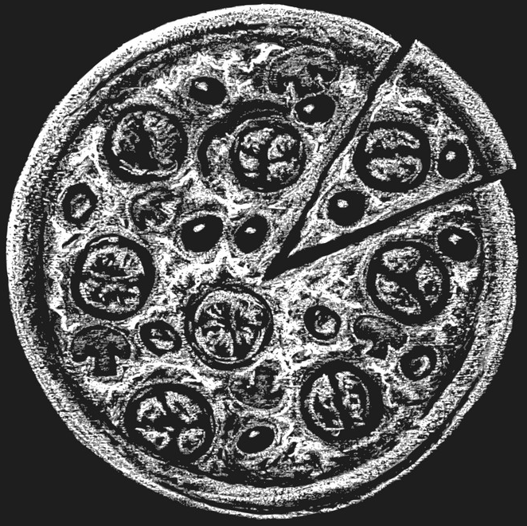

# _We Knead Pizza_

 

#### _A mock website for a pizza restaurant_

#### By _**Christina Welch**_

## Technologies Used

* _HTML_
* _CSS_
* _JavaScript_
* _Jquery_

## Description

_This is a mock pizza restaurant webpage made for Epicodus school as the week 4 project. It features object oriented programming which is used with Jquery to display a total cost for an order. thank you for visiting!_

## Setup/Installation Requirements

* _Clone this repository to your desktop_
* _Navigate to the top level of the directory_
* _open Pizza-Parlor/index.html_

_if you are unsure how to clone repositorys from github see https://docs.github.com/en/repositories/creating-and-managing-repositories/cloning-a-repository_

_Because this is just a simple webpage you can also just look at it by simply clicking the github-pages link under Enviorments on the right and then clicking view deployment on the right._

## tests

Describe: Order()

Test: "It should return an order object with three properties for toppings, size, and sides"
Code: const myPizza = new Pizza(["pepperoni", "olives"], "medium", ["bread", "coke"]);
Expected Output: Pizza { toppings: ["pepperoni", "olives"], size: "medium", sides: ["bread", "coke"] }

Test: "Order.price should return the total price of all items in the order and crate a new key with the price as the value"
Code: Order.price();
Expected Output: 25

## Known Bugs

* _designed for desktop. doesn't look great on mobile view but will work_

## License

_MIT_

Copyright (c) _10/15/2021_ _Christina Welch_